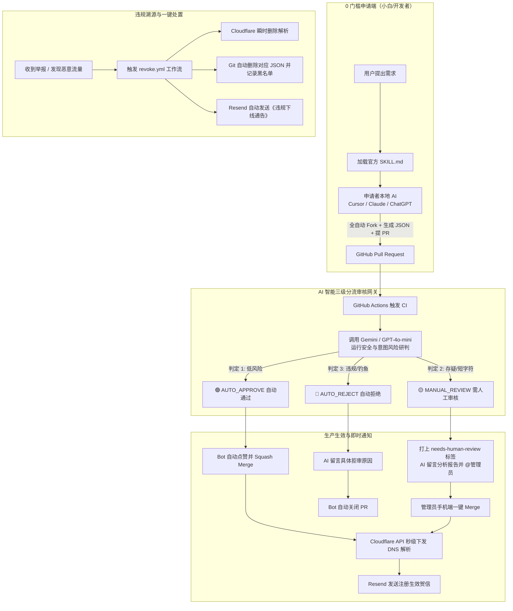

# 🌐 `tcp.red` & `udp.red` 免费二级域名分发系统技术方案 (全功能旗舰版)

本方案基于 **A2A（Agent-to-Agent）智能体交互体系**、**GitOps 自动化流程** 与 **Resend 现代邮件服务** 构建，具备 **0 服务器成本、0 运维负担、AI 智能三级分流审核、小白专属 AI Skill 一键申报** 的完整闭环。

---

## 🏗️ 1. 系统全景架构图 (End-to-End Workflow)



---

## 📁 2. 推荐仓库目录结构 (`red-domains/register`)

```text
red-domains/register
├── .github/
│   └── workflows/
│       ├── ai-audit.yml         # PR 自动化审核、AI 三级判定与自动合并
│       ├── sync-dns.yml         # Merge 后自动调用 Cloudflare 同步 + 发送成功邮件
│       └── revoke.yml           # 违规域名一键封禁与下线通告工作流
├── domains/
│   ├── tcp.red/                 # tcp.red 二级域名目录 (Web/API/穿透/博客)
│   │   ├── frp.json
│   │   └── blog.json
│   └── udp.red/                 # udp.red 二级域名目录 (游戏私服/QUIC/WireGuard)
│       ├── mc.json
│       └── derp.json
├── scripts/
│   ├── ai-evaluator.js          # AI 审核核心引擎 (Prompt & JSON 解析)
│   ├── cf-sync.js               # Cloudflare DNS API 同步逻辑
│   ├── mailer.js                # Resend 邮件发送模块
│   └── schema-validator.js      # JSON Schema 格式硬性校验
├── templates/
│   ├── success.html             # 注册成功技术风格邮件模板
│   └── takedown.html            # 违规封禁/暂停通告邮件模板
├── reserved.json                # 保留词 / 敏感词 / 知名品牌黑名单
├── SKILL.md                     # 供申请者 AI 读取的一键申请 Skill
└── README.md                    # 项目文档与服务条款 (TOS)
```

---

## 📄 3. 申请配置文件规范 (`domains/tcp.red/myapp.json`)

```json
{
  "description": "Micah's personal tech blog and documentation",
  "owner": {
    "username": "micahzheng",
    "email": "contact@yourdomain.com"
  },
  "record": {
    "CNAME": "micahzheng.github.io"
  },
  "proxied": false
}
```

> [!IMPORTANT]
> 1. `owner.email` 为**必填字段**；
> 2. 自动化脚本硬性拦截并拒绝 `@users.noreply.github.com` 等匿名伪造邮箱，确保安全下线和重要变更通知能够真实触达申请者。

---

## 🧠 4. AI 智能审核引擎与三级分流机制

### 判定逻辑与分流标准：

| 判定级别 | 特征画像 | 系统响应与动作 |
| :--- | :--- | :--- |
| **🟢 AUTO_APPROVE<br>(自动通过)** | - 目标为知名安全托管平台（`*.github.io`, `*.vercel.app`, `*.pages.dev`）<br>- 前缀无商标侵权、无钓鱼特征（如 `dev-tools`, `mc-server`, `alice-blog`）<br>- 用户 GitHub 账号注册时长 > 60 天 | 1. AI 输出 `95+` 信任评分；<br>2. 机器人自动执行 Squash Merge；<br>3. **30 秒内完成 Cloudflare DNS 绑定并发出生效邮件**。 |
| **🟡 MANUAL_REVIEW<br>(人工复核)** | - 申请 2~3 位稀缺短字符（如 `ai.tcp.red`, `vpn.udp.red`）<br>- 直接绑定未知裸公网 IP（A 记录）且描述用途较简略<br>- 用户 GitHub 账号为近 30 天新建账号 | 1. 自动附加 `needs-human-review` 标签；<br>2. AI 在 PR 留言《风险研判小结》并 `@管理员`；<br>3. 暂停自动合并，等待管理员在手机端点击 Merge。 |
| **🔴 AUTO_REJECT<br>(自动拒绝)** | - 仿冒知名品牌 / 钓鱼意图（如 `apple-login`, `binance-verify`）<br>- 混淆同音/同形词攻击（如 `paypa1`, `cl0udflare`）<br>- 描述中含恶意木马、色情、博彩、垃圾外链等违规内容 | 1. 机器人自动在 PR 详细列出驳回条款与原因；<br>2. 自动附加 `rejected` 标签并立即关闭 PR；<br>3. 前缀与提交者进入短期风控冷却名单。 |

---

## 📧 5. Resend 邮件通知服务深度集成

### 1. 资源配置
- **免费配额**：每月 **3,000 封**（每天上限 100 封），完全满足社区规模运作；
- **发信域名**：直接绑定主域 `notify.tcp.red` / `service.tcp.red`（在 Cloudflare 配置 SPF/DKIM 记录即可）。

### 2. 邮件发送核心模块 (`scripts/mailer.js`)
```javascript
import { Resend } from 'resend';
import fs from 'fs';
import path from 'path';

const resend = new Resend(process.env.RESEND_API_KEY);

export async function sendNotification({ to, username, domain, type, reason }) {
  const isTakedown = type === 'takedown';
  const templatePath = path.join(
    process.cwd(),
    'templates',
    isTakedown ? 'takedown.html' : 'success.html'
  );
  
  let html = fs.readFileSync(templatePath, 'utf8')
    .replace(/\{\{username\}\}/g, username)
    .replace(/\{\{domain\}\}/g, domain)
    .replace(/\{\{reason\}\}/g, reason || '安全合规策略下线或滥用通报');

  const subject = isTakedown
    ? `🚨 [安全通告] 域名 ${domain} 解析已被暂停 / 撤销`
    : `🎉 [生效通知] 域名 ${domain} 已成功上线并激活`;

  return await resend.emails.send({
    from: 'TCP/UDP Network Registry <notify@tcp.red>',
    to: [to],
    subject: subject,
    html: html,
  });
}
```

---

## 🤖 6. 小白专属申请 Skill (`SKILL.md`)

小白用户只需将此文件复制给自己的 AI（Cursor / Claude / ChatGPT / Antigravity），AI 即会自动按规范帮用户提交 PR：

```markdown
---
name: register-red-subdomain
description: 引导用户申请免费的 *.tcp.red 或 *.udp.red 二级域名，自动生成规范 JSON 并提交 Pull Request。
---

# 免费 *.tcp.red / *.udp.red 二级域名申请助手

## 1. 收集信息
- **目标协议域**：`tcp.red`（建站/API/博客/穿透）或 `udp.red`（游戏私服/WireGuard/QUIC）
- **申请前缀**：小写字母/数字/中划线（推荐长度 >= 3）
- **解析记录**：`CNAME`（如 `xxx.github.io`、`xxx.pages.dev`）或 `A`（公网 IP）
- **联系邮箱**：真实有效邮箱（用于接收生效与安全告警，**禁止填写 noreply 邮箱**）
- **用途描述**：如 "个人技术博客"、"Minecraft 联机私服"

## 2. 规范自检
- 检查是否存在 `login`, `bank`, `apple` 等敏感/保留词；
- 检查 JSON 语法与邮箱格式合法性。

## 3. 自动化提交流程
1. Fork 官方仓库并克隆到本地：`gh repo fork red-domains/register --clone`
2. 创建独立分支：`git checkout -b add-<subdomain>-<protocol>`
3. 新建配置文件 `domains/<protocol>.red/<subdomain>.json` 写入标准定义；
4. 提交并创建 PR：
   ```bash
   git add .
   git commit -m "feat(domain): add <subdomain>.<protocol>.red"
   git push origin add-<subdomain>-<protocol>
   gh pr create --title "Register <subdomain>.<protocol>.red" --body "### 申请信息\n- 域名: <subdomain>.<protocol>.red\n- 用途: <描述>"
   ```
```

---

## 🚨 7. 违规下线与一键处置工作流 (`.github/workflows/revoke.yml`)

当发现恶意钓鱼或收到滥用举报时，管理员只需在 GitHub Actions 界面点击 **Run Workflow**：
- **输入参数**：
  - `domain`: `bad-app.tcp.red`
  - `reason`: `Phishing / Malicious traffic detected by Cloudflare`
- **执行效果**：
  1. 脚本自动调用 Cloudflare API **毫秒级物理删除该 DNS 解析**；
  2. 自动在 Git 仓库中**删除该 JSON 文件并提交封禁记录**；
  3. 读取该配置内的 `owner.email`，调用 Resend **自动发送《域名暂停与违规处置告知函》**；
  4. 自动在 GitHub Issue 中公开归档下线日志。

---

## 💰 8. 运维成本核算

| 模块 | 选用服务 | 免费额度 / 成本 |
| :--- | :--- | :--- |
| **DNS 基础设施** | Cloudflare DNS API | 完全免费 |
| **CI/CD 自动化引擎** | GitHub Actions | 公开开源仓库**无限免费分钟数** |
| **AI 审核评估大脑** | Gemini 2.5 Flash / GPT-4o-mini | Google AI Studio（15 RPM 免费）/ 约 **$0.00** |
| **事务邮件通知** | Resend | 每月 **3,000 封免费**（100 封/天） |
| **总计成本** | — | **0 元 / 永久免费稳定运行** |
